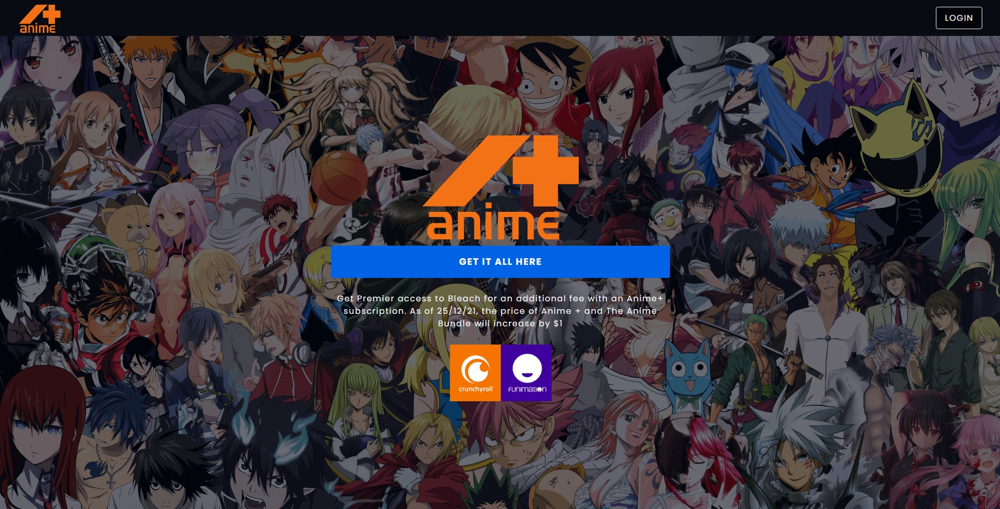

# Anime + Streaming app with React App

This is an Anime site inspired by the Disney Plus streaming platform. I built it using React, Redux, Firebase and Styled components.

  

## Technologies Used
- React
- Redux
- Styled Components
- Firebase
- Firebase store
- Firebase auth
- Firebase database
- Firebase storage

  

